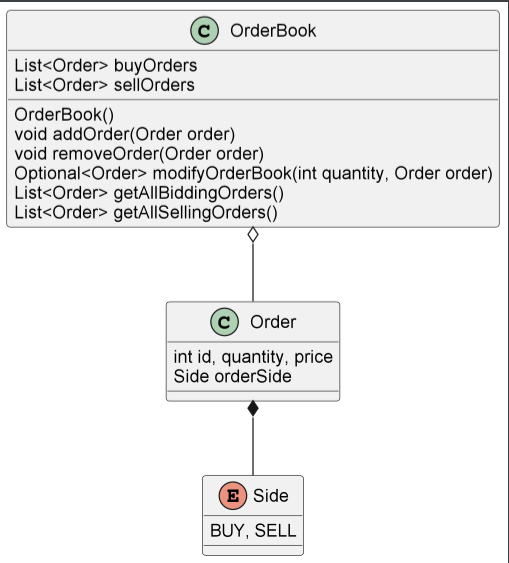

# Limit order book assessment 

## Class Diagram

### Data structures used (may change upon further studying and improvements)
Upon further studying an understanding of the problem at hand, and given the time 
limitation one had to submit this assessment. I decided to use Lists as a data 
structure for the matching engine which resulted in the modification of the OrderBook
class that currently holds the matching of a buying order with available selling 
order and with selling orders with available buying orders.

Given the fact that when an order is modified looses its priority we needed to use
a data structure that could allow such also we need to remove any order that has
been fulfilled is one the reasons why I decided go with ArrayList. This also allowed
to deliver the work in time. 